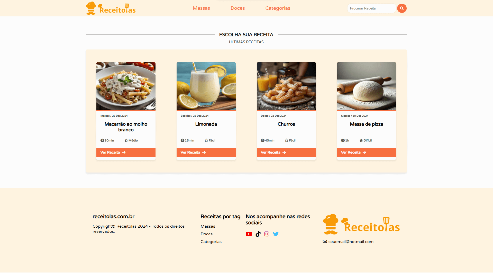
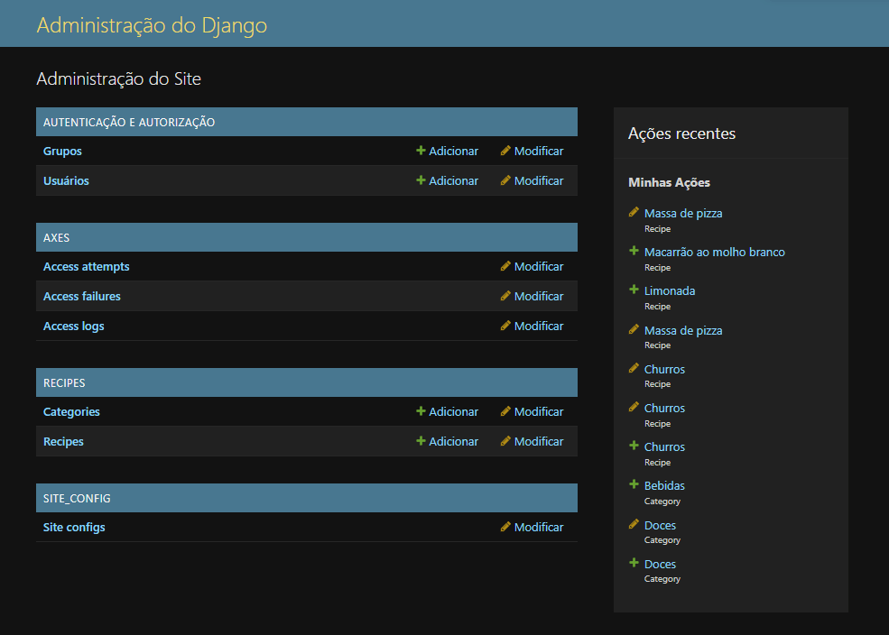
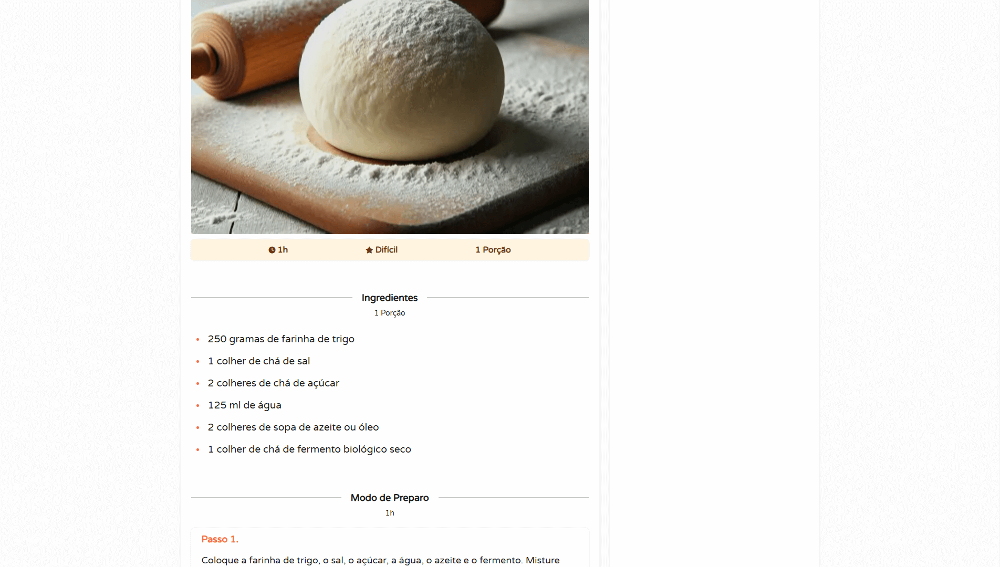
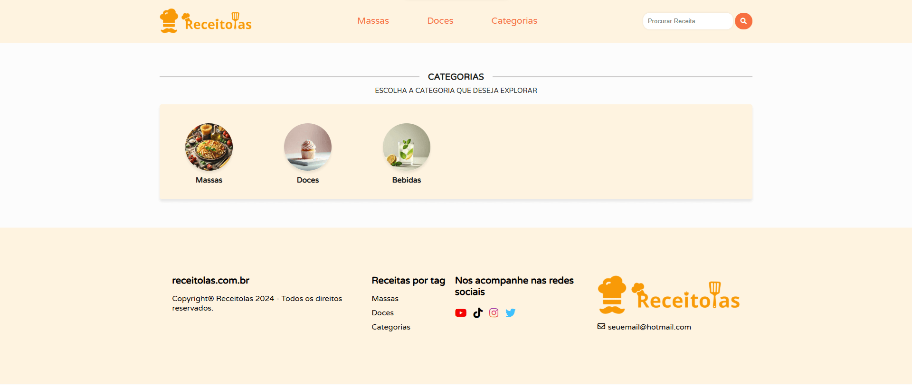

# RECEITOLAS

**Receitolas** é um site desenvolvido para salvar e compartilhar receitas culinárias. Esta é a **Versão 1** do projeto, com funcionalidades básicas implementadas.

---

## 🚀 Funcionalidades

A versão inicial do **Receitolas** inclui as seguintes funcionalidades:

- **Página Inicial (Home)**: Apresentação do site e navegação básica.

- **Cadastro de Receitas**: Usuários administradores podem registrar receitas e categorias através do painel Django Admin.

- **Página da Receita**: Exibição detalhada dos ingredientes, modo de preparo, e outras informações da receita selecionada.

- **Página de Categorias**: Exibição das categorias cadastradas. Ao clicar em uma categoria, são mostradas as receitas 
associadas a ela.


---

## 🛠️ Tecnologias Utilizadas

Este projeto foi desenvolvido utilizando as seguintes tecnologias:

- **[Django 5.1.3](https://www.djangoproject.com/)** - Framework web para Python, utilizado como base para o desenvolvimento do site.
- **[asgiref 3.8.1](https://asgiref.readthedocs.io/)** - Suporte para operações assíncronas, incluindo WebSockets e outros protocolos.
- **[django-axes 7.0.1](https://django-axes.readthedocs.io/)** - Proteção contra ataques de força bruta nos formulários de login.
- **[Pillow 11.0.0](https://pillow.readthedocs.io/)** - Biblioteca para manipulação de imagens, incluindo upload, redimensionamento e tratamento de imagens.
- **[pycodestyle 2.12.1](https://pycodestyle.readthedocs.io/)** - Ferramenta para garantir que o código esteja de acordo com o estilo PEP 8.
- **[python-dateutil 2.9.0](https://dateutil.readthedocs.io/)** - Manipulação de datas e fusos horários.
- **[six 1.17.0](https://six.readthedocs.io/)** - Compatibilidade entre Python 2 e Python 3.
- **[sqlparse 0.5.2](https://buildmedia.readthedocs.org/media/pdf/sqlparse/latest/sqlparse.pdf)** - Analisador e formatador de SQL.
- **[typing_extensions 4.12.2](https://typing-extensions.readthedocs.io/)** - Suporte a anotações de tipo em versões anteriores do Python.
- **[tzdata 2024.2](https://pypi.org/project/tzdata/)** - Informações de fusos horários.
- **[webencodings 0.5.1](https://pypi.org/project/webencodings/)** - Codificação de caracteres para compatibilidade com diferentes plataformas.

---

## 💻 Como Rodar o Projeto

### 1. Clonando o Repositório

Clone o repositório para sua máquina local:

```
git clone https://github.com/usuario/NomeDoRepositorio.git
```

### 2. Instalando Dependências

Entre no diretório do projeto e instale as dependências:

```
cd NomeDoRepositorio
pip install -r requirements.txt
```

### 3. Realizando as Migrações

No diretório do projeto, faça as migrações para configurar o banco de dados:

```
python manage.py makemigrations
python manage.py migrate
```

### 4. Criando um Superusuário

Crie um superusuário para acessar o painel de administração do Django:

```
python manage.py createsuperuser
```

Preencha as informações solicitadas (nome de usuário, email, senha). Após criar o superusuário, você poderá acessar o painel admin.

### 5. Rodando o Servidor

Execute o servidor local do Django:

```
python manage.py runserver
```

O site estará disponível em [http://127.0.0.1:8000/](http://127.0.0.1:8000/). 

Acesse [http://127.0.0.1:8000/admin](http://127.0.0.1:8000/admin) e faça login com o superusuário criado para gerenciar o conteúdo do site através do painel de administração.

---

## ⚙️ Configurações
Se precisar configurar o banco de dados ou outras opções do projeto, consulte os arquivos de configuração em settings.py e siga as instruções na documentação.

---

## 📞 Contato
Se você tiver alguma dúvida, sugestão, quiser colaborar ou alguma oportunidade sinta-se à vontade para entrar em contato!

**LinkedIn:** [João Victor](https://www.linkedin.com/in/jo%C3%A3o-victor-de-souza-lima-b2ab6a319/)

---
